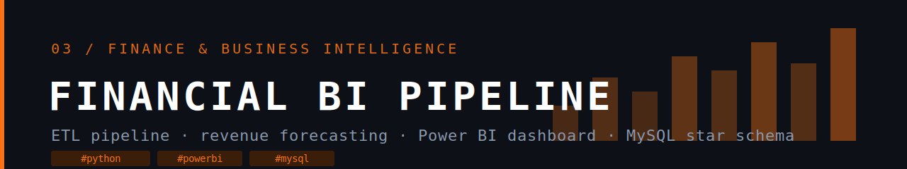

# Financial BI Pipeline 🚀

An automated, end-to-end financial intelligence system built with Python, MySQL, and Power BI. 
This project simulates real-world business data, processes it through an automated ETL pipeline, 
detects anomalies, forecasts future revenue using Facebook Prophet, and visualises everything 
in an interactive Power BI dashboard.

## 🛠️ Tech Stack
- **Python** — ETL pipeline, data simulation, anomaly detection, forecasting
- **MySQL** — Star schema database for structured data storage
- **Power BI** — Interactive dashboard with DAX measures and What-If analysis
- **Prophet (Meta)** — Time series forecasting for 90-day revenue prediction
- **Windows Task Scheduler** — Daily automated pipeline execution

## ⚙️ Architecture
Daily Trigger (Task Scheduler)
↓
simulate_data.py → data/raw/
↓
etl_pipeline.py (clean → validate → flag anomalies → load)
↓
MySQL Database (star schema)
↓
forecast.py (Prophet 90-day forecast)
↓
Power BI Dashboard (auto-refresh)

## ✨ Features
- Automated daily data pipeline with zero manual intervention
- Data validation — null removal, duplicate detection, invalid value filtering
- Anomaly detection — flags suspicious discounts and negative profit transactions
- 90-day revenue forecasting with confidence intervals using Facebook Prophet
- Interactive Power BI dashboard with 5 pages and 6 DAX measures
- What-If discount analysis — simulate profit impact of changing discount rates
- Professional logging system recording every pipeline run

## 📊 Dashboard Pages
1. Executive Summary — KPIs, sales trend, segment and regional breakdown
2. Regional Analysis — map, profit margin by region, segment distribution
3. Product Analysis — top products, category treemap, sales vs profit scatter
4. Anomaly Detection — flagged transactions table, anomalies by region and category
5. Sales Forecast — 90-day Prophet forecast with confidence interval bands

## 🚀 How to Run
1. Clone the repo
2. Create virtual environment: `python -m venv venv`
3. Activate: `venv\Scripts\activate`
4. Install dependencies: `pip install -r requirements.txt`
5. Set up `.env` file with MySQL credentials
6. Run pipeline: `python scripts/etl_pipeline.py`
7. Run forecast: `python scripts/forecast.py`
8. Open Power BI file and refresh data
